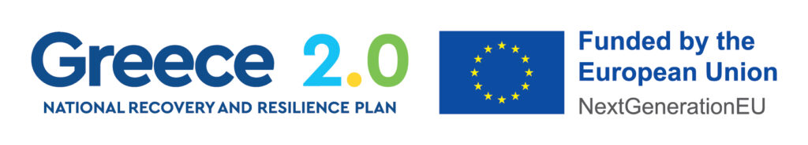

# GRAsPAD: Generalized framework for optimal grasp key-points active detection

The research project "CARPOS - Coachable Robot for Fruit Picking Operations" is implemented in the framework of H.F.R.I call "Basic Research Financing (Horizontal support of all Sciences)" under the National Recovery and Resilience Plan "Greece 2.0" funded by the European Union – NextGenerationEU(H.F.R.I. Project Number: 16523).

https://carpos.hmu.gr/ 

  
  

